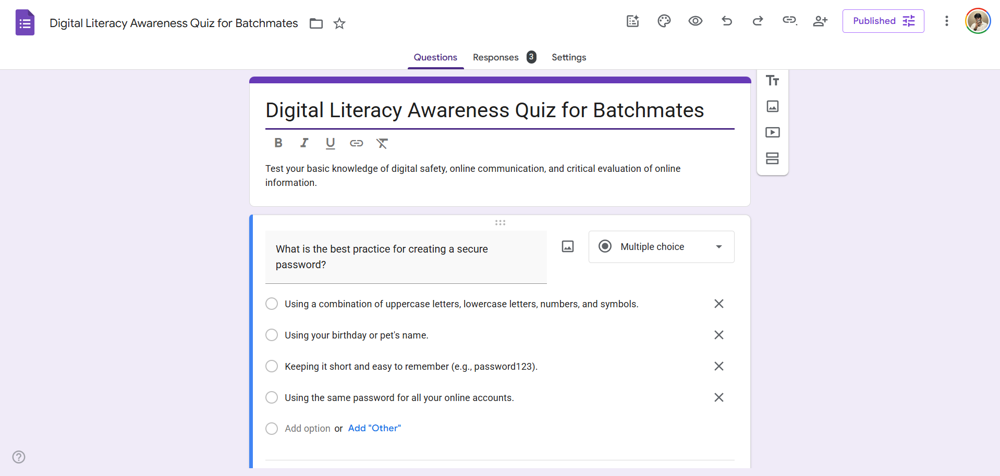

# Task 3 — Coding & Collaboration Platforms

## Part A — Coding Practice

### Platform: HackerRank
- **URL:** https://www.hackerrank.com
- **Challenge Completed:** Print Hello World with Python
- **Description:** Simple task to print hello world using Python
- **Screenshot:** **

---

## Part B — Google Workspace Collaboration

### Digital Literacy Awareness Quiz (Google Form)
- **Form Link:** *https://forms.gle/fWr7NmJD81zWEmBeA*
- **Description:** Created a 5-question Digital Literacy Awareness Quiz designed to test batchmates' knowledge of key digital literacy concepts.

- **Screenshot of Form:** **
- **Screenshot of Response Sheet:** **

---

## Reflection

Working on this task introduced me to two very different but equally important aspects of the digital ecosystem. HackerRank showed me how coding practice platforms provide a structured way to build problem-solving skills — the instant feedback from test cases is incredibly motivating. On the other hand, creating the Google Form quiz was an exercise in collaboration and content creation. Framing clear, unambiguous questions is harder than it looks; I had to think carefully about what a "wrong" answer should look like to make the quiz genuinely useful. Linking the form to a Google Sheet and seeing how responses auto-populate was a practical introduction to how cloud collaboration tools work in real settings like surveys, event registrations, and team feedback.
